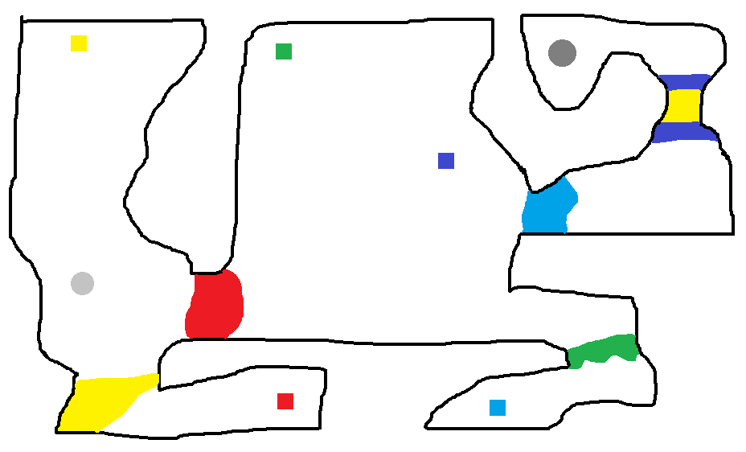

# JPS-Maze-With-Keys-Solver

# Main idea
Given a *Bitmap* image file that represents a maze with zero or more keys, walls, doors, starting zone and one or more ending zones, we have to find a path from the starting zone to any of the ending zones(using zero or more keys to unlock the doors) or conclude that no such a path exists.

# Description
Every pixel represents a different object according to its RGB value.
* black pixels(0,0,0) - impassable zones(walls);
* white pixels(255,255,255) - passable zones;
* other pixels - keys, doors, starting zone, ending zone(s);

##### Starting zone
The starting zone is represented by a single figure(circle, square, etc.) consisting of pixels with an RGB value: (195,195,195).

##### Ending zone(s)
Every ending zone is represented by a figure consisting of pixels with an RGB value: (127,127,127).

##### Keys
Every key is a colored square (20x20 pixels) and its color is not white or black and differs from the colors of the starting zone and the ending zone(s).

##### Doors
In the maze there may be zones colored with colors other than white, black and gray(starting zone and ending zone(s)). These are zones that can only be crossed if we have the corresponding key. Тheir dimensions are different from those of the keys(20x20) and we have to collect the key that corresponds to the specific *door* before we can get through it. We do **not** lose keys when passing through *doors*.

**NOTE**: Besides the keys, any other zone in the maze can be of any shape and size.

# Input
Image file in a *Bitmap* format that represents a correct maze.

# Output
Another image in a *Bitmap* format that shows a possible path of escaping from the maze and a text file that describes the path as a sequence of points. The path between two points is a straight line connecting them and every line in the text file describes the coordinates of a given point.

# Example
* **INPUT**

* **OUTPUT**

